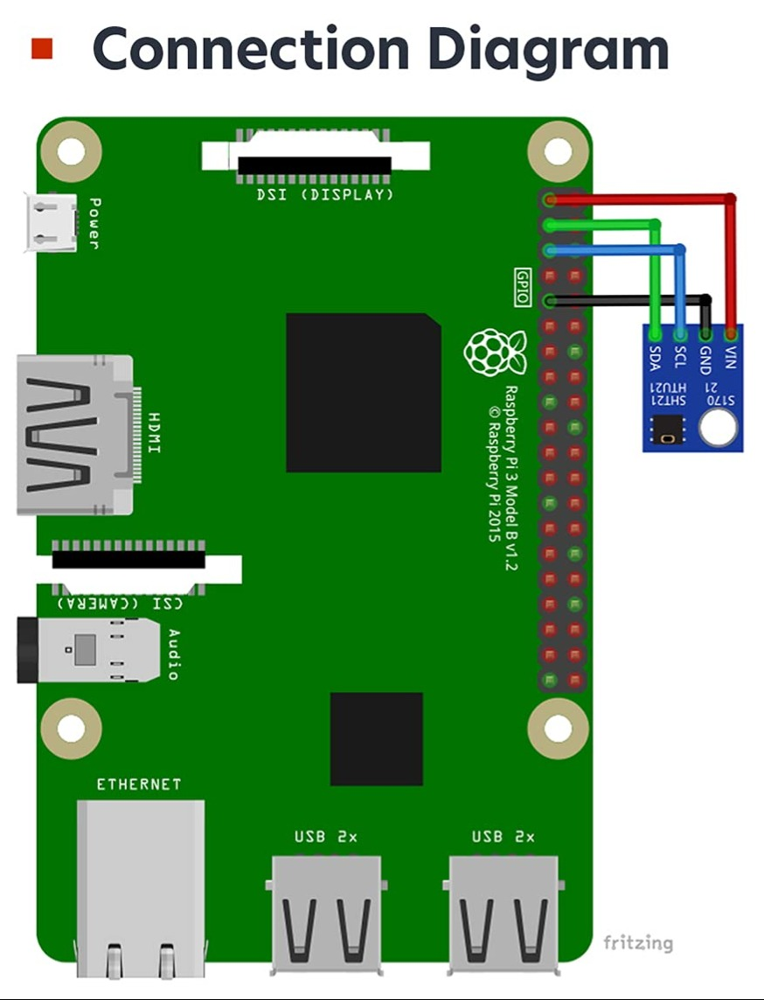

# htu21

`htu21` Small HTTP service targeting the Raspberry Pi that reads temperature and humidity from an [GY-21](https://www.alibaba.com/product-detail/GY-21-HTU21-Breakout-Board-Environmental_1601576560724.html)/[HTU21](https://www.az-delivery.uk/products/gy-21-temperatur-sensor-modul) board with an [SHT21](https://sensirion.com/products/catalog/SHT21) sensor over I²C and makes it available on the network by returning JSON to a simple HTTP API.

Default port: **273** (configurable via `HTU21_PORT` environment variable).

- Endpoints:
  - `GET /` → `{"temperature_c":..,"humidity_percent":..,"timestamp_utc":".."}`
  - `GET /health` → `{"status":"ok"}`

## Prerequisites

- Raspberry Pi with I²C enabled: (`sudo raspi-config` → *Interface Options* → *I2C* → Enable)
- Check your user is in the `i2c` group.
- Wiring:  
  - VCC → 3.3V (pin 1)
  - GND → GND (pin 9)
  - SDA → GPIO2 (pin 3)
  - SCL → GPIO3 (pin 5)



---

## Quick run (no install)

1. Download and extract the release tarball:
   ```bash
   tar xzf htu21-linux-arm.tar.gz
   cd htu21-linux-arm
   ```

2. Run:
   ```bash
   sudo ./htu21             # listens on port 273 by default
   ```
   Optional: allow binding to ports <1024 without sudo
   ```bash
   sudo setcap 'cap_net_bind_service=+ep' ./htu21
   ./htu21
   ```
   Or change the port:
   ```bash
   HTU21_PORT=8080 ./htu21
   ```

3. Test:
   ```bash
   curl http://localhost:273/
   curl http://localhost:273/health
   ```

---

## Install as a `systemd` service

The service will be installed to `/opt/htu21` and run as a dedicated `htu21` system user.

```bash
cd /tmp
tar xzf htu21-linux-arm.tar.gz
cd htu21-linux-arm
./install.sh
```

The installer:
- Creates `/opt/htu21/` directory with the binary
- Adds `htu21` system user for running the service
- Adds systemd service at `/etc/systemd/system/htu21.service`

Check status and logs:

```bash
systemctl status htu21
journalctl -u htu21 -f
```


---

## Change the port

### 1. Edit the service (recommended)

```bash
sudo nano /etc/systemd/system/htu21.service
# in the [Service] section, set:
Environment=HTU21_PORT=273
```

Reload and restart:

```bash
sudo systemctl daemon-reload
sudo systemctl restart htu21
```

---

## Uninstall

```bash
cd htu21-linux-arm
./uninstall.sh
```

---

### JSON examples

```bash
curl -s http://localhost:273/ | jq .
# {
#   "sensor": "HTU21/SHT21",
#   "temperature_c": 21.37,
#   "humidity_percent": 48.12,
#   "timestamp_utc": "2025-09-20T00:00:00.0000000Z"
# }

curl -s http://localhost:273/health
# {"status":"ok"}
```