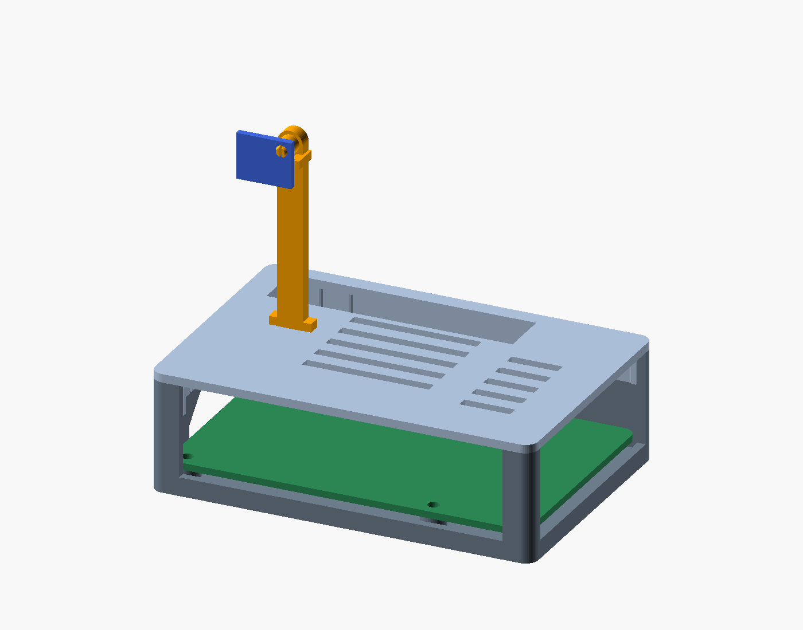

# Raspberry Pi 3 Model B+ enclosure versions

- **[v2 — simple upright post](v2/README.md): current design.** A small push-in post
  on the lid holds the sensor 35 mm above it. Start here for new prints.
- **[v1 — side arm](v1/README.md): preserved reference.** The previous dovetail arm
  design, editable source, original input, STL exports and assembly rendering.

Each version is self-contained. Use a base, lid and sensor mount from the same
version. The GY-21 hole diameter and position remain provisional in both versions.

