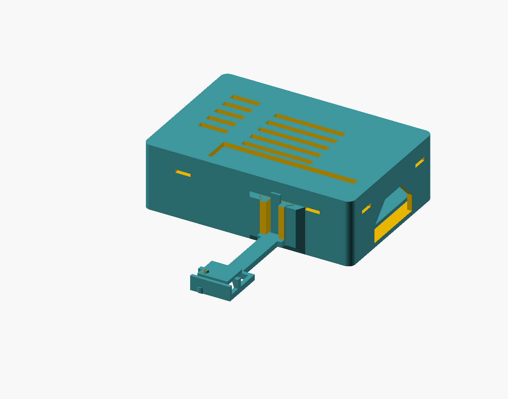

# V1: preserved side-arm enclosure

This is the previous design, preserved for reference. For the simpler upright
post, see [v2](../v2/README.md). V1 SCAD and STL geometry are unchanged.

Editable source: [pi3bplus_htu21_case.scad](pi3bplus_htu21_case.scad). Units are **mm**.
This revises the supplied enclosure rather than replacing its mounting geometry.
The untouched [original SCAD](archive/pi3bplus_htu21_case.scad) is retained for
reference; its old STL exports can be regenerated if needed. Print the current
files in **stl/**.



## Files to print

| File | Purpose | Orientation already in STL |
| --- | --- | --- |
| [sensor_mount_test.stl](stl/sensor_mount_test.stl) | First print: receiver coupon and shortened sensor carrier, two separate bodies | Both flat bottoms on bed |
| [pi3bplus_base.stl](stl/pi3bplus_base.stl) | Case with standoffs and integrated dovetail receiver | Floor on bed; open side up |
| [pi3bplus_lid.stl](stl/pi3bplus_lid.stl) | Snap lid with GPIO window and vents | Outside/top face on bed; skirt and tabs up |
| [htu21_sensor_arm.stl](stl/htu21_sensor_arm.stl) | Removable arm with split PCB lug | Arm/frame flat on bed; dovetail, release spring and lug up |

The coupon uses the **same modules and tolerances** as the final parts, with only
the thermal spacing shortened. It is about 3.1 cm³ of solid CAD volume, approximately
4 g of PLA before slicer infill settings. Do not use its shortened carrier beside
a powered Pi for temperature measurements.

## What changed

- The two rectangular side sockets/plugs are replaced by a single top-entry
  dovetail receiver, blended into the GPIO-side wall with a sloping underside.
  It projects only **3.6 mm** and has a bottom stop. Two male dovetail flanks locate
  the arm and resist twist; an independent central spring locks into a blind
  catch in the case wall. No sensor-arm screws are needed.
- The release tip is exposed above the rail. Pull it outward and lift the arm
  approximately **17 mm**; the lid remains fitted and the Pi stays in its case.
- The nearest sensor PCB edge is **38 mm from the main case wall**, or 34.4 mm
  beyond the receiver's outermost face. The slim arm reduces conductive coupling;
  ambient airflow and orientation still influence temperature readings.
- The sensor's component/sensing face stays completely open. The underside has
  an open window, 3 mm standoff clearance, small edge supports and a support ring
  around the mounting hole. A split, tapered lug retains the PCB without a screw.
  Fences sit outside the PCB; no clips bear on its components.
- The previous wire arch is removed. The full solder edge opens into a fork with
  6 mm of open space before the PCB. Four wires can bend down or out without
  threading through a small tunnel.
- The original 85 × 56 mm Pi layout, 58 × 49 mm mounting pattern, floor vents and
  top vents are retained. Base height is increased from 22 to **26 mm** (28 mm
  assembled with cap). USB/Ethernet and power/HDMI/audio bays extend to the rim,
  and the corresponding lid skirt is removed so it cannot obscure connectors.
  The microSD opening has 45° roof shoulders, reducing its bridge from 28 to 12 mm.
- Four isolated lid spring tabs now engage matching case catches. The lid has
  no fasteners. These changes also leave the GPIO header accessible from above.

## Measure these provisional dimensions

The supplied sensor PCB size is **13.0 × 10.8 × 1.6 mm**. The hole and component
layout have not been measured. Defaults below are explicitly **prototype values**,
not measurements inferred from the repository's wiring illustration.

Sensor coordinates are viewed from the component side: X runs left to right;
Y=0 is the four-wire solder edge; Y increases toward the opposite edge. Orient
the board that way when checking the following values.

| SCAD parameter | Default | Meaning / adjustment |
| --- | --- | --- |
| `sens_hole_d` | **2.50** | **PROVISIONAL mounting-hole diameter; measure first** |
| `sens_hole_x`, `sens_hole_y` | **10.8, 8.6** | **PROVISIONAL hole centre from left and wire edges** |
| `sens_hole_land_d` | 4.4 | Provisional diameter of component-free underside land at hole |
| `sens_support_inset` | 0.60 | Provisional bare-PCB edge land contacted by supports |
| `sens_support_h` | 3.0 | Clearance below PCB; increase for underside components |
| `sens_wire_keepout` | 3.5 | Provisional depth of solder area from wire edge |
| `sens_wire_drop_clear` | 6.0 | Open space before the PCB; increase for bulky solder joints |
| `sens_gap` | 38 | Main wall to nearest PCB edge, constrained to 30–40 mm |
| `standoff_bore` | 2.3 | Provisional M2.5 screw pilot; this is **not** a clearance hole |

Verify that the support lands are actually bare PCB. Reposition the hole or
adjust the support parameters for your board before fitting it. Do not push the
PCB down if a support touches a component or solder joint. The source asserts
that the hole's support land clears the solder strip and stays inside the PCB.

## Print settings and tolerance tuning

- Typical **0.4 mm nozzle**, **0.16–0.20 mm layers**, **3–4 perimeters**,
  **4–5 top/bottom layers**, and **20–30% infill**. Start at 0.16 mm for the coupon.
- PETG is preferable for repeated spring operation; PLA is suitable for a fit
  prototype, with gentler handling. Use good layer adhesion and a slow small-feature
  speed. The vertical release spring and tiny lug still depend on layer bonding.
- Enable variable-width/thin-wall handling. Confirm the slicer preserves the
  1.0 mm release spring, 0.65 mm lug slit, and both approximately 0.83 mm lug fingers.
  Do not fill the slit or the dovetail gaps with generated supports.
- Supports are not intended in the stated orientations. The dock has a sloping
  underside, the PCB ledges are ramped, and the lug/tooth have lead-in slopes.
  Small bridges remain: the microSD roof is 12 mm, lid catch windows about 6.5 mm,
  and the blind latch pocket about 4.5 mm. Inspect bridge quality in the slicer.
- Use elephant-foot compensation suited to your printer; remove only first-layer
  flare and strings from mating edges. Keep brim out of slots or remove it fully.
  A small brim can help the upright receiver coupon if bed adhesion is poor.

| Fit parameter | Default | How to tune using coupon |
| --- | --- | --- |
| `dock_fit` | 0.25 mm | Normal gap on each dovetail face. Increase in 0.05 mm steps if it binds; reduce if it rocks. This is per face, not total width. |
| `latch_engagement` | 0.35 mm | Tooth penetration into case wall. Reduce slightly if release force is excessive; do not force or file away the whole catch. |
| `latch_t` | 1.0 mm | Spring thickness. Avoid thinning below reliably printable widths. |
| `lug_diametral_clear` | 0.20 mm | Stem is this much smaller than measured hole diameter. |
| `lug_head_overlap` | 0.12 mm radial | Head is hole diameter + 0.24 mm. Reduce in small increments if PCB will not gently snap over it. |
| `lug_slot` | 0.65 mm | Gap allowing the two lug halves to flex. Keep clear of strings. |
| `lug_axial_clear` | 0.20 mm | Nominal clearance above PCB before the head's retaining region; no PCB compression intended. |
| `sens_edge_fit` | 0.35 mm | Gap from PCB edges to external fences. |
| `lid_clear`, `lid_snap_engagement` | 0.30, 0.25 mm | Per-side skirt gap and lid catch overlap. The sensor coupon does not test lid fit. |

Do not scale an STL to tune a fit: that also changes hardware dimensions. Edit
the SCAD parameter and regenerate the coupon and affected production parts.

## Assembly

1. Measure the sensor hole diameter and centre; verify bare support lands and
   underside clearance. Set the provisional values, then export/print the coupon.
2. Hold the coupon receiver upright. Align the carrier's dovetail flanks above
   the receiver and slide down to the bottom stop. The central tongue should
   click into the catch. It should resist lift and twist without large force.
3. Pull the exposed central tongue tip **away from the wall** while lifting the
   carrier. Nominal tooth release travel is about 1.1 mm (tip travels farther).
   Flex only enough to release it. Test a few insertion/removal cycles first.
4. Test the sensor lug with the component side facing up. Support the frame below
   the hole and gently press the PCB over the tapered head until it rests on the
   edge ledges/ring. Check that the slit stays open and no component is loaded.
   To remove the PCB, squeeze the split head gently and lift at the hole; avoid
   levering the sensing package. Usually leave the PCB fitted and remove the arm.
5. Print the full base, lid and arm once the two coupon fits are satisfactory.
   Fix the Pi to the four standoffs using suitable M2.5 screws. M2.5 × 4 mm gives
   about 2.4 mm engagement through a 1.6 mm PCB; confirm the actual screw/head and
   pilot fit. Prepare/tap the pilots for your chosen screws if necessary. The
   standoffs provide 3 mm engagement; do not drive screws through the floor.
6. Connect four wires to 3.3 V (pin 1), GND (pin 9), SDA (pin 3) and SCL (pin 5).
   The GY-21/HTU21 I²C address remains **0x40**. Rewiring is fine. Route the wires
   through the GPIO window, leaving a loose loop for the arm's 17 mm lift travel.
   Keep solder joints clear of the frame; do not tension wires against the sensor.
7. Seat the lid evenly until all four tabs engage. The GPIO window and grouped
   openings should leave GPIO, USB, Ethernet, HDMI, power, audio and microSD usable.
   Install the full sensor arm using the same slide-and-click motion as the coupon.
8. For lid removal, press its tabs inward through the small catch windows and lift
   each released edge gently. Arm removal is independent of the lid. If completely
   separating a wired arm from the Pi, disconnect the four wires at accessible GPIO.

Position the sensor outside rising warm exhaust and away from nearby hot objects.
The design separates it mechanically; thermal accuracy needs a powered comparison
with an ambient reference, which CAD alone cannot establish.

## Editing, rendering and validation

Open the SCAD in desktop OpenSCAD or a compatible online OpenSCAD editor. It has
no library dependencies. `part="assembly"` is the default; use `"exploded"` for an
exploded view, or `"base"`, `"lid"`, `"sensor"`, `"test"` for printable selections.
The assembly's PCB shapes are clearance references, not printable electronics.

With Python 3 and OpenSCAD on PATH, from the repository root:

```text
python enclosure/rpi3bplus/v1/build.py --checks --renders
```

For a portable Windows executable:

```powershell
python enclosure/rpi3bplus/v1/build.py --openscad .tools/openscad/openscad-2021.01/openscad.com --checks --renders
```

Or export one part directly (PowerShell's native argument quoting varies by version;
the Python helper avoids that issue):

```sh
openscad -D 'part="test"' -o enclosure/rpi3bplus/v1/stl/sensor_mount_test.stl enclosure/rpi3bplus/v1/pi3bplus_htu21_case.scad
```

The build checks closed triangle meshes, consistent winding, degenerate triangles,
connected bodies and Z=0 print placement. OpenSCAD intersection checks cover the
seated arm/case, base/lid, PCB/supports, Pi PCB/case and a conservative arm withdrawal
envelope with the lid fitted. Intended zero-thickness seating contacts are excluded
from PCB/rim checks by 0.02 mm. The released spring uses a clearance proxy, not FEA.
The build generates `renders/validation.json` and PNG views of every part, the
coupon, assembly, exploded assembly and interface. The JSON diagnostics are ignored by Git. The existing assembly preview is
preserved here; additional PNGs can be regenerated with the command above.

These checks do **not** substitute for a physical coupon, slicer review, repeated
spring-cycle testing, cable-plug trial fit or a powered thermal test. No detailed
Pi component/plug CAD was supplied; grouped openings are intentionally generous,
and opening/skirt dimensions remain editable. A full-size HAT is not modelled.

Pi mounting geometry reference: Raspberry Pi's
[official 3 B+ mechanical drawing](https://datasheets.raspberrypi.com/rpi3/raspberry-pi-3-b-plus-mechanical-drawing.pdf)
and [product brief, physical specification](https://datasheets.raspberrypi.com/rpi3/raspberry-pi-3-b-plus-product-brief.pdf).
